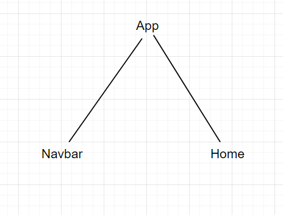

# Angular - Getting Started - Exercises

**Use Git or GitHub Desktop to push each exercise to GitHub**

_NOTE_: Make projects all non-strict mode

_NOTE_: You will need to use Google & your fellow classmates!

---

---

## Exercise 1: Manually create a component

- Create a new angular project called `manually-create-component`
- Without using the Angular CLI to generate a component, manually create a `home` component.
- Create a paragraph tag that says, "I'm home!"
- The home component should be nested in the `app` component
- "I'm home" should be displayed on the webpage when you run `ng serve`

---

## Exercise 2: Generate a component

- Create a new angular project called `generate-angular-component`
- Using the Angular CLI, generate a component called `post`
- Inside the post's template, create a `div` element with the content "I'm a post!"
- The `post` component should be nested in the `app` component.
- "I'm a post!" should be displayed on the webpage when you run `ng serve`

---

## Exercise 3: Manually create a component and style it

- Create a new angular project called `manually-create-component-style`
- **Without** using the Angular CLI to generate a component, manually create a `paragraph-list` component.
- Inside of the `paragraph-list` template, create multiple paragraph elements with content
- The `paragraph-list` component should be nested in the `app` component
- Inside the `paragraph-list.component.css`, create a couple of CSS classes to change the background color or the text color of each paragraph element
- Run `ng serve` in the terminal, and each paragraph element should have a change of style

---

## Exercise 4: Create multiple components

- Create a new angular project called `create-multiple-components`
- Manually create or use the angular CLI to generate two components: `navbar` and `home`
- Edit the navbar's component template (`navbar.component.html`) to contain a paragraph element with the content "I'm the navbar!"
- Edit the home's component template (`home.component.html`) to contain a paragraph element with the content "I'm the home!"
- Display each component in the app component
- Run `ng serve` in the terminal, and you should see both paragraph tags

---

## Exercise 5: Create dynamic content via variables

1. Using the Terminal, create a new project titled `dynamic-content`.

2. In the "app.component.html" file, add an h1 element and a paragraph element. Add content in both elements.

3. Create a variable in the "app.component.ts" file `name: sting = "William". (Use your own name).

4. Display this variable inside the h1 element we created earlier.

5. Push your angular project to GitHub using GitHub Desktop.

**Bonus**: Install Bootstrap and then include styling to your HTML elements.

**Bonus**: add an input element and include "ngModel" to dynamically change the "name" variable.

_Note_: You will have to import the FormsModule to the app.module from @angular/core and include it within the imports array.
